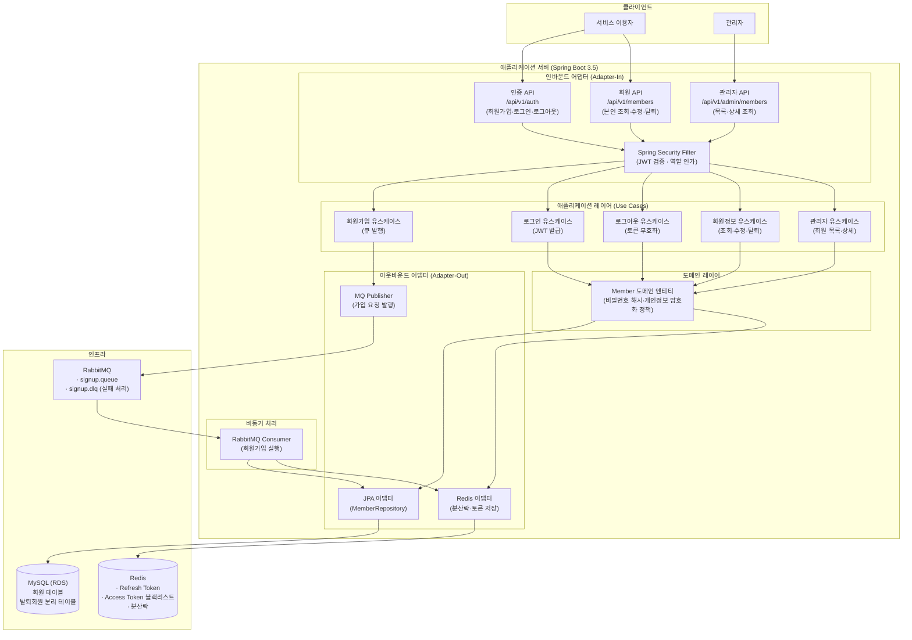
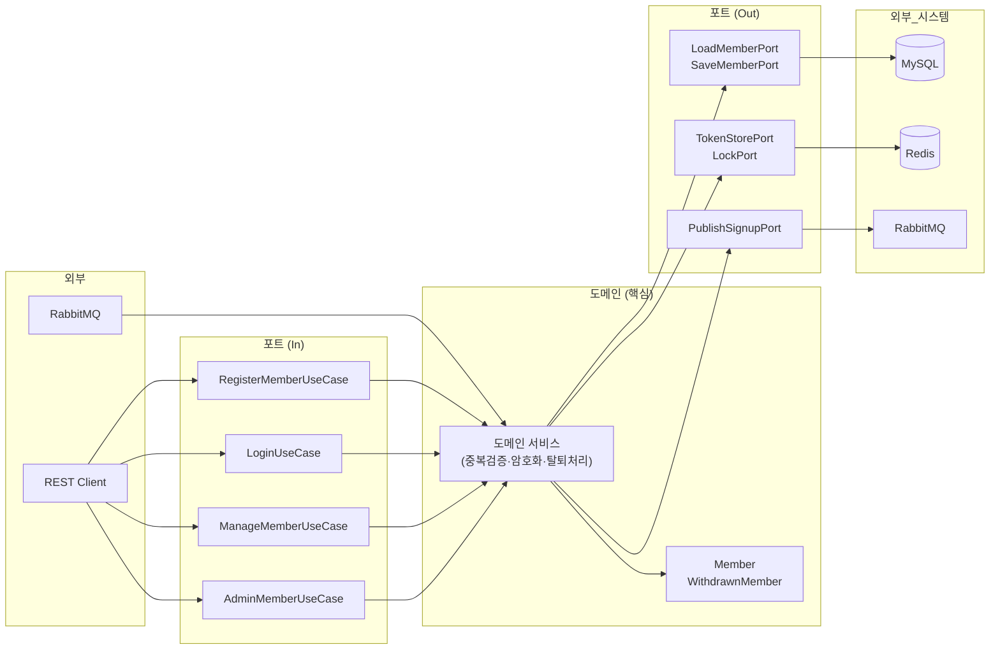
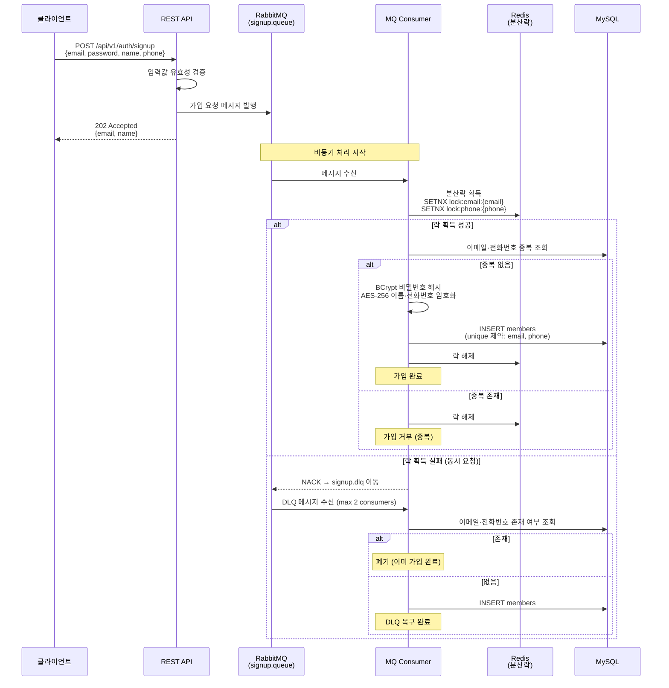

# 아키텍처 설계

## 기술 스택

| 항목 | 선택 |
|------|------|
| Language | Java 25 |
| Framework | Spring Boot 3.5.13 |
| Database | MySQL (RDS) |
| Cache / 분산락 | Redis (Sentinel) |
| 메시지 큐 | RabbitMQ |
| Build | Gradle|

---

## 핵심 설계 결정

| 쟁점          | 선택 | 이유 |
|-------------|------|------|
| 급증 트래픽 처리   | RabbitMQ 비동기 큐 | DB 직접 부하 차단, 배압 제어 |
| 동시 중복 가입 방지 | Redis 분산락 + DB 유니크 제약 | 이중 방어: 락으로 1차, DB로 최종 보장 |
| 인증 방식       | JWT (Access 15분 + Refresh 7일) | 무상태 확장성, Redis로 로그아웃·블랙리스트 처리 |
| 개인정보 암호화    | BCrypt(PW) + AES-256(이름·전화번호) | 비밀번호는 단방향, 나머지는 조회 필요로 양방향 |
| 회원 탈퇴 처리    | 분리 테이블 보관 후 기간 만료 파기 | 개인정보보호법 준수 |

---

## 1. 전체 시스템 구조


---

## 2. 프로젝트 모듈 구조

```
user-management/
├── domain/
│   ├── Member.java                  # 도메인 엔티티
│   ├── WithdrawnMember.java         # 탈퇴회원 (개인정보보호법 분리 보관)
│   └── vo/                          # Email, Password, PhoneNumber 값 객체
├── application/
│   ├── port/
│   │   ├── in/                      # UseCase 인터페이스 (인바운드 포트)
│   │   └── out/                     # Repository·Cache·MQ 포트 (아웃바운드 포트)
│   └── service/                     # 유스케이스 구현체
└── adapter/
    ├── in/
    │   └── web/                     # REST Controller, Request/Response DTO
    └── out/
        ├── persistence/             # JPA Entity, Repository 구현체
        ├── cache/                   # Redis 구현체 (토큰·분산락)
        └── messaging/               # RabbitMQ Publisher / Consumer
```

---

## 3. 프로젝트 계층구조



## 4. 회원가입 흐름



## 5. API 목록

| 메서드 | 경로 | 역할 | 설명                                       |
|--------|------|------|------------------------------------------|
| POST | /api/v1/auth/signup | 비인증 | 회원 가입 (비동기, 202 반환, email·name 포함)       |
| POST | /api/v1/auth/login | 비인증 | 로그인 (JWT 발급, email·name 포함)              |
| POST | /api/v1/auth/logout | USER·ADMIN | 로그아웃 (토큰 무효화)                            |
| POST | /api/v1/auth/refresh | USER·ADMIN | Access Token 재발급(유효기간 만료 후에도 사용자 편의성 보장) |
| GET | /api/v1/members/me | USER | 본인 정보 조회                                 |
| PUT | /api/v1/members/me | USER | 본인 정보 수정                                 |
| DELETE | /api/v1/members/me | USER | 회원 탈퇴                                    |
| GET | /api/v1/admin/members | ADMIN | 회원 목록 조회                                 |
| GET | /api/v1/admin/members/{id} | ADMIN | 특정 회원 상세 조회                              |
